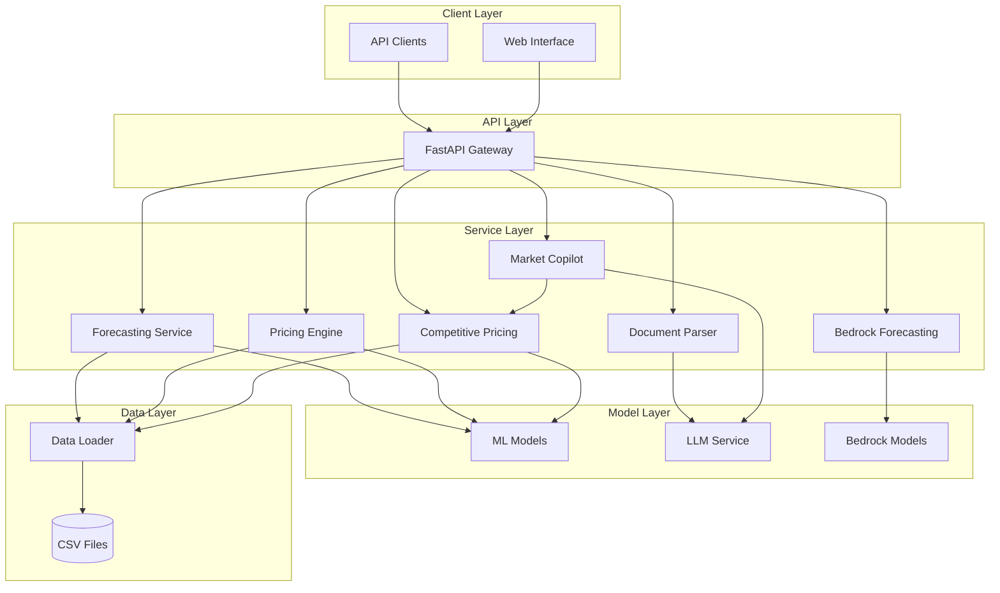

# Design Document: AI for Retail, Commerce & Market Intelligence

## Overview

The AI for Retail, Commerce & Market Intelligence platform is a Python-based solution designed for the AI for Bharat Hackathon. The system specializes in price trend forecasting for precious metals (gold/silver coins) and popular Indian ETFs, providing comprehensive market intelligence through machine learning models and natural language processing.

The platform follows a modular architecture with clear separation of concerns, enabling easy maintenance and scalability. The core system processes historical price data from CSV files, applies machine learning algorithms for forecasting, and provides intelligent pricing recommendations through a FastAPI-based REST interface.

**Current Indian Market Integration (February 2026):**
- **24K Gold Prices**: ₹1,30,000 - ₹1,60,000 per 10 grams (~₹1.3-1.6 Lakh)
- **Silver Prices**: ₹2,80,000 - ₹3,70,000 per kg (~₹2.8-3.7 Lakh)  
- **GOLDBEES ETF**: ₹140-170 per unit reflecting higher gold prices
- **Market Characteristics**: Includes GST (3%), making charges, festival season effects, and Indian trading patterns
- **Currency Formatting**: Proper INR display with lakh/crore notation
- **Trading Centers**: Mumbai, Delhi, Chennai market dynamics incorporated

## Architecture

The system follows a layered architecture pattern with the following key layers:

### Data Layer
- **CSV Data Storage**: Sample datasets stored in `/data` directory with current Indian market pricing
- **Data Loading**: Centralized data loading and validation through `data_loader.py`
- **Data Preprocessing**: Cleaning, normalization, and feature engineering
- **Indian Price Generation**: Realistic Indian market data generation via `generate_indian_prices.py`
- **Price Verification**: Data validation and testing utilities (`check_indian_prices.py`, `test_data_loading.py`)
- **Service Management**: Automated restart and refresh capabilities (`restart_services.py`)

### Model Layer
- **Forecasting Engine**: Machine learning models for price prediction (`forecasting_model.py`)
- **Pricing Engine**: Intelligent pricing algorithms (`pricing_engine.py`)
- **Document Parser**: LLM-based text extraction (`document_parser.py`)

### Service Layer
- **Market Copilot**: AI assistant for financial Q&A with integrated competitive pricing intelligence (`market_copilot.py`)
- **API Gateway**: FastAPI endpoints for external integration (`api.py`)
- **Competitive Pricing Engine**: Multi-platform price comparison and analysis (`competitive_pricing.py`)
- **Bedrock Forecasting Engine**: Amazon Bedrock foundation model integration framework (`bedrock_forecasting.py`)

### Infrastructure Layer
- **Configuration Management**: Environment-specific settings including Bedrock configuration
- **Logging and Monitoring**: Comprehensive logging for debugging and monitoring
- **Error Handling**: Centralized error handling and validation
- **Cost Tracking**: Bedrock usage and cost monitoring



## Components and Interfaces

### Data Loader Component (`data_loader.py`)

**Purpose**: Centralized data loading, validation, and preprocessing for all CSV datasets.

**Key Classes**:
- `DataLoader`: Main class for loading and preprocessing CSV data
- `PriceDataValidator`: Validates price data format and integrity
- `DataPreprocessor`: Handles cleaning, normalization, and feature engineering

**Key Methods**:
```python
class DataLoader:
    def load_gold_prices(self, file_path: str) -> pd.DataFrame
    def load_silver_prices(self, file_path: str) -> pd.DataFrame
    def load_etf_prices(self, file_path: str) -> pd.DataFrame
    def validate_price_data(self, data: pd.DataFrame) -> bool
    def preprocess_data(self, data: pd.DataFrame) -> pd.DataFrame
```

**Interfaces**:
- Input: CSV file paths
- Output: Validated and preprocessed pandas DataFrames
- Error Handling: Custom exceptions for data validation failures

### Indian Price Data Generation (`generate_indian_prices.py`)

**Purpose**: Generate realistic Indian precious metals price data with current market rates and characteristics.

**Key Features**:
- **Current Market Rates**: 24K Gold ₹1.55 Lakh per 10g, Silver ₹3.2 Lakh per kg
- **Indian Market Patterns**: Festival season effects, salary cycle impacts, weekly trading patterns
- **Realistic Volatility**: Gold 1.5%, Silver 2.2% with Indian market characteristics
- **OHLC Generation**: Complete open, high, low, close data with proper relationships
- **Volume Simulation**: Realistic trading volumes for Indian markets
- **ETF Integration**: GOLDBEES, NIFTYBEES, BANKBEES with current market levels

**Key Functions**:
```python
def create_indian_gold_data(days: int, gold_type: str) -> pd.DataFrame
def create_indian_silver_data(days: int) -> pd.DataFrame  
def create_indian_etf_data(days: int) -> pd.DataFrame
def generate_realistic_indian_prices(start_price: float, days: int, volatility: float) -> List[float]
```

### Price Verification Utilities

**Purpose**: Validate and test the generated Indian price data.

**Components**:
- `check_indian_prices.py`: Quick price verification and current market comparison
- `test_data_loading.py`: Automated testing of data loading functionality
- `restart_services.py`: Service management and data refresh automation

**Key Features**:
- Real-time price validation against expected Indian market ranges
- Automated service restart for data refresh
- Comprehensive testing of data pipeline integrity

### Forecasting Model Component (`forecasting_model.py`)

**Purpose**: Machine learning-based price forecasting for gold, silver, and ETFs.

**Key Classes**:
- `PriceForecastingEngine`: Main forecasting engine
- `TimeSeriesModel`: Abstract base class for forecasting models
- `ModelEvaluator`: Performance evaluation and metrics calculation

**Key Methods**:
```python
class PriceForecastingEngine:
    def train_model(self, data: pd.DataFrame, target_column: str) -> None
    def predict_prices(self, horizon: int) -> Dict[str, Any]
    def get_confidence_intervals(self) -> Tuple[np.ndarray, np.ndarray]
    def evaluate_model(self, test_data: pd.DataFrame) -> Dict[str, float]
```

**Supported Models**:
- ARIMA for traditional time series analysis
- Prophet for handling seasonality and trends
- LSTM for deep learning-based forecasting
- XGBoost for ensemble-based predictions

### Pricing Engine Component (`pricing_engine.py`)

**Purpose**: Intelligent pricing recommendations based on market analysis and forecasting results.

**Key Classes**:
- `PricingEngine`: Main pricing optimization engine
- `MarketAnalyzer`: Market condition analysis
- `PricingStrategy`: Different pricing strategies implementation

**Key Methods**:
```python
class PricingEngine:
    def analyze_market_conditions(self, price_data: pd.DataFrame) -> Dict[str, Any]
    def recommend_pricing(self, current_price: float, forecast: Dict) -> Dict[str, float]
    def calculate_volatility(self, price_data: pd.DataFrame) -> float
    def generate_pricing_report(self) -> Dict[str, Any]
```

### Document Parser Component (`document_parser.py`)

**Purpose**: LLM-based document analysis and text extraction for financial documents.

**Key Classes**:
- `DocumentParser`: Main document processing engine
- `LLMService`: Mock/inference-ready LLM integration
- `FinancialEntityExtractor`: Extract financial entities and metrics

**Key Methods**:
```python
class DocumentParser:
    def parse_document(self, document_path: str) -> Dict[str, Any]
    def extract_financial_entities(self, text: str) -> List[Dict]
    def classify_document_type(self, text: str) -> str
    def extract_market_insights(self, text: str) -> Dict[str, Any]
```

**LLM Integration**:
- Mock service for local development and testing
- AWS Bedrock-compatible interface for production deployment
- Configurable model selection and parameters

### Market Copilot Component (`market_copilot.py`)

**Purpose**: AI-powered assistant for natural language queries about financial data.

**Key Classes**:
- `MarketCopilot`: Main conversational AI engine
- `QueryProcessor`: Natural language query understanding
- `ResponseGenerator`: Context-aware response generation

**Key Methods**:
```python
class MarketCopilot:
    def process_query(self, query: str, context: Dict) -> str
    def update_context(self, new_data: Dict) -> None
    def get_financial_insights(self, query: str) -> Dict[str, Any]
    def maintain_conversation_history(self, query: str, response: str) -> None
```

### API Gateway Component (`api.py`)

**Purpose**: FastAPI-based REST interface for external system integration.

**Key Endpoints**:
```python
# Price Forecasting Endpoints
POST /api/v1/forecast/gold
POST /api/v1/forecast/silver
POST /api/v1/forecast/etf

# Pricing Recommendations
GET /api/v1/pricing/recommendations
POST /api/v1/pricing/analyze

# Competitive Pricing Endpoints
GET /api/v1/price-comparison/{product_name}
GET /api/v1/price-comparison/product/{product_id}
GET /api/v1/price-comparison/products
GET /api/v1/price-comparison/best-deals
GET /api/v1/price-comparison/platforms/summary

# Document Processing
POST /api/v1/documents/parse
GET /api/v1/documents/insights

# Market Copilot
POST /api/v1/copilot/query
GET /api/v1/copilot/context

# Bedrock Integration (Framework)
POST /api/v1/bedrock/forecast/{symbol}
POST /api/v1/bedrock/compare/{symbol}
POST /api/v1/bedrock/insights

# Data Management
GET /api/v1/data/status
POST /api/v1/data/reload
```

### Competitive Pricing Engine Component (`competitive_pricing.py`)

**Purpose**: Multi-platform price comparison and analysis across Indian e-commerce platforms.

**Key Classes**:
- `CompetitivePricingEngine`: Main price comparison engine
- `PriceComparison`: Data model for comparison results
- `CompetitivePricingCopilot`: Integration with Market Copilot

**Key Methods**:
```python
class CompetitivePricingEngine:
    def compare_prices(self, product_id: str) -> Optional[PriceComparison]
    def get_product_list(self) -> List[Dict[str, str]]
    def search_products(self, query: str) -> List[Dict[str, str]]
    def get_best_deals(self, limit: int = 10) -> List[Dict[str, Any]]
    def get_platform_summary(self) -> Dict[str, Any]
```

**Supported Platforms**:
- Amazon India
- Flipkart
- JioMart
- Blinkit
- Zepto
- DMart Ready

### Bedrock Forecasting Engine Component (`bedrock_forecasting.py`)

**Purpose**: Amazon Bedrock foundation model integration framework for advanced forecasting.

**Key Classes**:
- `BedrockForecastingEngine`: Main Bedrock integration engine
- `ClaudeForecaster`: Claude 3 Sonnet/Haiku implementation
- `TitanForecaster`: Amazon Titan Text implementation
- `HybridForecastingEngine`: Combines traditional ML with foundation models

**Key Methods**:
```python
class BedrockForecastingEngine:
    def forecast_with_bedrock(self, symbol: str, historical_data: List, horizon: int, model_name: str) -> BedrockForecastResponse
    def compare_model_predictions(self, symbol: str, historical_data: List, horizon: int) -> Dict[str, BedrockForecastResponse]
    def get_model_capabilities(self) -> Dict[str, Any]
```

**Supported Models**:
- Claude 3 Sonnet (complex analysis, detailed explanations)
- Claude 3 Haiku (fast inference, cost-effective)
- Amazon Titan Text Premier (balanced performance)

### Bedrock Configuration Component (`bedrock_config.py`)

**Purpose**: Configuration and cost management for Bedrock integration.

**Key Classes**:
- `BedrockSettings`: Configuration management
- `BedrockModelRegistry`: Model capabilities and configurations
- `BedrockUseCaseMapper`: Optimal model selection for use cases
- `BedrockCostTracker`: Usage and cost monitoring

**Key Methods**:
```python
class BedrockSettings:
    def get_model_parameters(self, model: BedrockModel) -> Dict[str, Any]
    def validate_credentials(self) -> bool
    def get_client_config(self) -> Dict[str, Any]
```

## Data Models

### Price Data Model

```python
@dataclass
class PriceData:
    timestamp: datetime
    open_price: float
    high_price: float
    low_price: float
    close_price: float
    volume: Optional[int] = None
    symbol: str = ""
    
    def validate(self) -> bool:
        return (self.high_price >= self.low_price and 
                self.high_price >= self.open_price and 
                self.high_price >= self.close_price and
                self.low_price <= self.open_price and 
                self.low_price <= self.close_price)
```

### Forecast Result Model

```python
@dataclass
class ForecastResult:
    symbol: str
    forecast_horizon: int
    predicted_prices: List[float]
    confidence_intervals: Dict[str, List[float]]
    model_metrics: Dict[str, float]
    timestamp: datetime
    
    def get_accuracy_score(self) -> float:
        return self.model_metrics.get('accuracy', 0.0)
```

### Pricing Recommendation Model

```python
@dataclass
class PricingRecommendation:
    symbol: str
    current_price: float
    recommended_price: float
    confidence_score: float
    market_conditions: Dict[str, Any]
    reasoning: str
    timestamp: datetime
    
    def get_price_change_percentage(self) -> float:
        return ((self.recommended_price - self.current_price) / self.current_price) * 100
```

### Document Analysis Model

```python
@dataclass
class DocumentAnalysis:
    document_id: str
    document_type: str
    extracted_entities: List[Dict[str, Any]]
    market_insights: Dict[str, Any]
    confidence_scores: Dict[str, float]
    processing_timestamp: datetime
    
    def get_key_insights(self) -> List[str]:
        return [insight for insight, score in self.market_insights.items() 
                if self.confidence_scores.get(insight, 0) > 0.7]
```

### Market Query Model

```python
@dataclass
class MarketQuery:
    query_id: str
    user_query: str
    processed_query: str
    response: str
    context_data: Dict[str, Any]
    confidence_score: float
    timestamp: datetime
    
    def is_high_confidence(self) -> bool:
        return self.confidence_score > 0.8
```

### Price Comparison Model

```python
@dataclass
class PriceComparison:
    product_id: str
    product_name: str
    current_prices: Dict[str, float]
    lowest_platform: str
    highest_platform: str
    lowest_price: float
    highest_price: float
    price_difference_percentage: float
    savings_amount: float
    recommendation: str
    trend_7_days: Dict[str, float]
    trend_30_days: Dict[str, float]
    analysis_timestamp: datetime
    
    def to_dict(self) -> Dict[str, Any]:
        return {
            'product_id': self.product_id,
            'product_name': self.product_name,
            'current_prices': self.current_prices,
            'lowest_platform': self.lowest_platform,
            'highest_platform': self.highest_platform,
            'lowest_price': self.lowest_price,
            'highest_price': self.highest_price,
            'price_difference_percentage': self.price_difference_percentage,
            'savings_amount': self.savings_amount,
            'recommendation': self.recommendation,
            'trend_7_days': self.trend_7_days,
            'trend_30_days': self.trend_30_days,
            'analysis_timestamp': self.analysis_timestamp.isoformat()
        }
```

### Bedrock Forecast Response Model

```python
@dataclass
class BedrockForecastResponse:
    symbol: str
    predictions: List[float]
    confidence_intervals: List[Dict[str, float]]
    model_explanation: str
    risk_assessment: Dict[str, Any]
    market_insights: List[str]
    timestamp: datetime
    
    def to_dict(self) -> Dict[str, Any]:
        return {
            'symbol': self.symbol,
            'predictions': self.predictions,
            'confidence_intervals': self.confidence_intervals,
            'model_explanation': self.model_explanation,
            'risk_assessment': self.risk_assessment,
            'market_insights': self.market_insights,
            'timestamp': self.timestamp.isoformat()
        }
```

## Error Handling

### Exception Hierarchy

```python
class AIRetailIntelligenceError(Exception):
    """Base exception for the AI Retail Intelligence platform"""
    pass

class DataLoadingError(AIRetailIntelligenceError):
    """Raised when data loading fails"""
    pass

class ModelTrainingError(AIRetailIntelligenceError):
    """Raised when model training fails"""
    pass

class ForecastingError(AIRetailIntelligenceError):
    """Raised when forecasting fails"""
    pass

class DocumentParsingError(AIRetailIntelligenceError):
    """Raised when document parsing fails"""
    pass

class LLMServiceError(AIRetailIntelligenceError):
    """Raised when LLM service encounters errors"""
    pass
```

### Error Response Format

```python
@dataclass
class ErrorResponse:
    error_code: str
    error_message: str
    details: Optional[Dict[str, Any]] = None
    timestamp: datetime = field(default_factory=datetime.now)
    request_id: Optional[str] = None
```

## Testing Strategy

The testing strategy employs a dual approach combining unit tests for specific functionality and property-based tests for comprehensive validation of universal properties.

### Unit Testing Approach

Unit tests focus on:
- **Specific Examples**: Concrete test cases with known inputs and expected outputs
- **Edge Cases**: Boundary conditions and error scenarios
- **Integration Points**: Component interactions and API endpoints
- **Mock Services**: LLM service mocking for consistent testing

### Property-Based Testing Approach

Property tests validate universal properties across randomized inputs:
- **Data Validation Properties**: Ensure data integrity across all possible inputs
- **Model Consistency Properties**: Verify forecasting model behavior
- **API Contract Properties**: Validate API responses for all valid inputs
- **Financial Logic Properties**: Ensure pricing calculations follow financial principles

**Configuration**:
- Minimum 100 iterations per property test
- Each test tagged with feature name and property reference
- Comprehensive input generation for financial data scenarios
- Statistical validation of model outputs

**Property-Based Testing Library**: The system will use `hypothesis` for Python property-based testing, providing robust input generation and statistical validation capabilities.

### Test Organization

```
tests/
├── unit/
│   ├── test_data_loader.py
│   ├── test_forecasting_model.py
│   ├── test_pricing_engine.py
│   ├── test_document_parser.py
│   ├── test_market_copilot.py
│   └── test_api.py
├── property/
│   ├── test_data_properties.py
│   ├── test_forecasting_properties.py
│   ├── test_pricing_properties.py
│   └── test_api_properties.py
├── integration/
│   ├── test_end_to_end.py
│   └── test_api_integration.py
└── fixtures/
    ├── sample_data.py
    └── mock_services.py
```

## Correctness Properties

*A property is a characteristic or behavior that should hold true across all valid executions of a system—essentially, a formal statement about what the system should do. Properties serve as the bridge between human-readable specifications and machine-verifiable correctness guarantees.*

### Property 1: Multi-Asset Price Forecasting Consistency
*For any* valid historical price dataset (gold, silver, or ETF), the Price_Forecasting_Engine should generate forecasts with consistent statistical properties and appropriate confidence intervals
**Validates: Requirements 1.1, 1.2, 1.3, 1.5, 3.3**

### Property 2: Multi-Horizon Forecast Generation
*For any* valid historical price data, the System should generate both short-term and long-term forecasts with appropriate time horizons (daily, weekly, monthly)
**Validates: Requirements 1.4, 3.7**

### Property 3: Volatility-Adaptive Forecasting
*For any* price dataset with varying volatility levels, the System should adjust forecasting models appropriately and reflect volatility in confidence intervals
**Validates: Requirements 1.6**

### Property 4: Universal CSV Data Loading
*For any* valid CSV file containing price data (gold, silver, or ETF format), the Data_Loader should successfully load, validate, and preprocess the data into a consistent format
**Validates: Requirements 2.1, 2.2, 2.3, 2.4, 2.5**

### Property 5: Data Pipeline Integration
*For any* successfully loaded price dataset, the processed data should be immediately available and properly formatted for consumption by forecasting models
**Validates: Requirements 2.7**

### Property 6: Model Learning Consistency
*For any* training dataset with identifiable patterns or cycles, the Price_Forecasting_Engine should capture and reflect these patterns in its predictions
**Validates: Requirements 3.2, 3.5**

### Property 7: Model Performance Evaluation
*For any* completed model training session, the System should generate comprehensive performance metrics using appropriate financial evaluation criteria
**Validates: Requirements 3.4**

### Property 8: Model Retraining Capability
*For any* existing trained model and new price data, the System should successfully retrain the model and produce updated forecasting capabilities
**Validates: Requirements 3.6**

### Property 9: Market Condition Analysis
*For any* current market data for gold and silver, the Pricing_Engine should generate consistent market condition analysis and appropriate pricing recommendations
**Validates: Requirements 4.1, 4.2**

### Property 10: Volatility-Aware Pricing
*For any* market data with measurable volatility, the Pricing_Engine should factor volatility levels into pricing recommendations with appropriate risk adjustments
**Validates: Requirements 4.3**

### Property 11: Comprehensive Pricing Reports
*For any* pricing analysis request, the System should generate complete reports containing market analysis, recommendations, and supporting data for gold and silver coins
**Validates: Requirements 4.5**

### Property 12: Cross-Asset Pricing Intelligence
*For any* combination of precious metals and ETF performance data, the Pricing_Engine should incorporate ETF performance metrics into precious metals pricing decisions
**Validates: Requirements 4.6**

### Property 13: Document Text Extraction
*For any* valid financial document, the Document_Parser should successfully extract text content and identify key financial entities and metrics
**Validates: Requirements 5.1, 5.2**

### Property 14: Document Classification Consistency
*For any* financial document, the Document_Parser should classify the document type and extract relevant market insights with consistent accuracy
**Validates: Requirements 5.3, 5.5**

### Property 15: Natural Language Query Processing
*For any* valid financial query about gold, silver, or ETF trends, the Market_Copilot should provide relevant, contextually appropriate answers
**Validates: Requirements 6.1, 6.2**

### Property 16: Conversation Context Maintenance
*For any* sequence of related queries in a conversation session, the Market_Copilot should maintain context and provide coherent responses that reference previous interactions
**Validates: Requirements 6.4**

### Property 17: Data Update Responsiveness
*For any* price data update, the Market_Copilot should reflect the changes in subsequent responses and provide insights based on the updated information
**Validates: Requirements 6.5, 6.6**

### Property 18: API Request Validation
*For any* API request to any endpoint, the API_Gateway should validate input parameters, handle authentication, and return appropriate responses or error messages
**Validates: Requirements 7.2, 7.5**

### Property 19: API Response Consistency
*For any* successful API request, the System should return well-structured JSON responses that conform to the documented API schema
**Validates: Requirements 7.4**

### Property 20: Rate Limiting Enforcement
*For any* sequence of API requests exceeding defined limits, the API_Gateway should enforce rate limiting consistently and return appropriate HTTP status codes
**Validates: Requirements 7.6**

### Property 21: Multi-Platform Price Comparison
*For any* valid product identifier, the Competitive_Pricing_Engine should successfully compare prices across all available platforms and identify the lowest and highest prices
**Validates: Requirements 13.1, 13.2, 13.3**

### Property 22: Savings Calculation Accuracy
*For any* product with price variations across platforms, the System should accurately calculate potential savings amount and percentage with mathematical precision
**Validates: Requirements 13.4**

### Property 23: Price Trend Analysis Consistency
*For any* product with sufficient historical data, the Competitive_Pricing_Engine should generate consistent 7-day and 30-day price trend analysis
**Validates: Requirements 13.6**

### Property 24: Best Deals Ranking
*For any* set of products with price variations, the System should correctly identify and rank products with the highest savings potential in descending order
**Validates: Requirements 13.7**

### Property 25: Competitive Pricing Query Integration
*For any* competitive pricing query, the Market_Copilot should correctly route the query to the Competitive_Pricing_Engine and provide formatted responses
**Validates: Requirements 14.1, 14.2**

### Property 26: Pricing Context Integration
*For any* pricing analysis update, the Market_Copilot should reflect changes in subsequent responses and provide contextual recommendations
**Validates: Requirements 14.5, 14.6**

### Property 27: Bedrock Model Integration
*For any* valid forecasting request, the Bedrock_Forecasting_Engine should successfully interface with foundation models and provide detailed explanations and reasoning
**Validates: Requirements 15.1, 15.2, 15.3**

### Property 28: Hybrid Forecasting Consistency
*For any* forecasting scenario, the System should successfully combine traditional ML and foundation model predictions into coherent ensemble forecasts
**Validates: Requirements 15.4**

### Property 29: Bedrock Cost Optimization
*For any* sequence of Bedrock API calls, the System should track usage costs and enforce configured limits while optimizing model selection for cost-effectiveness
**Validates: Requirements 15.5**

### Property 30: Graceful Bedrock Fallback
*For any* Bedrock service unavailability, the System should gracefully fallback to traditional forecasting methods without service interruption
**Validates: Requirements 15.7**

### Property 31: Indian Market Price Accuracy
*For any* generated gold or silver price data, the System should produce prices within current Indian market ranges (₹1.3-1.6 Lakh per 10g gold, ₹2.8-3.7 Lakh per kg silver) with proper INR formatting
**Validates: Requirements 18.1, 18.2, 18.6**

### Property 32: Indian Market Characteristics Integration
*For any* price data generation, the System should incorporate realistic Indian market patterns including festival effects, GST considerations, and trading center dynamics
**Validates: Requirements 18.3, 18.7**