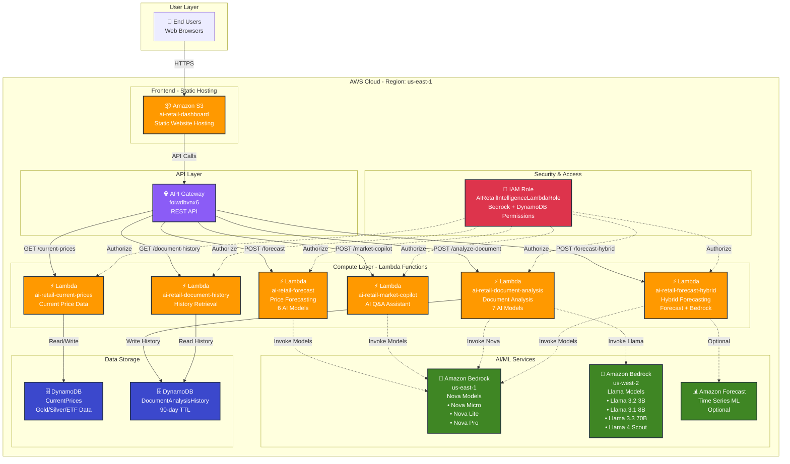
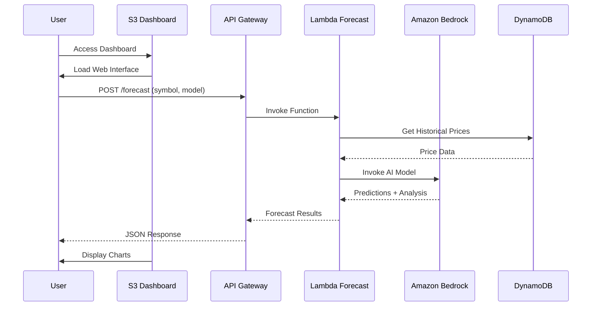
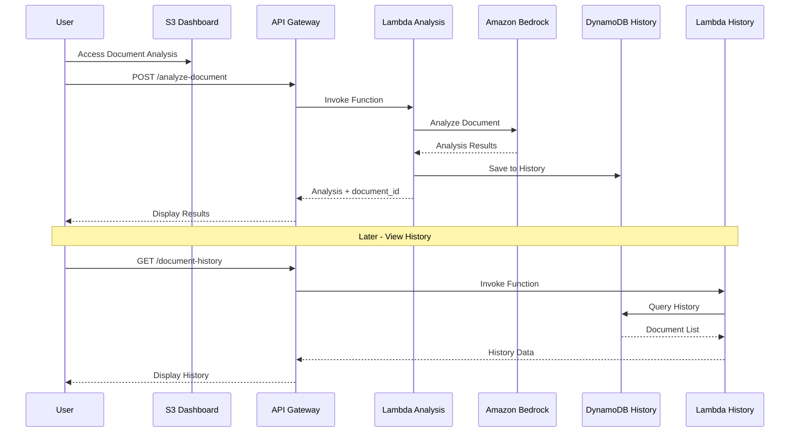
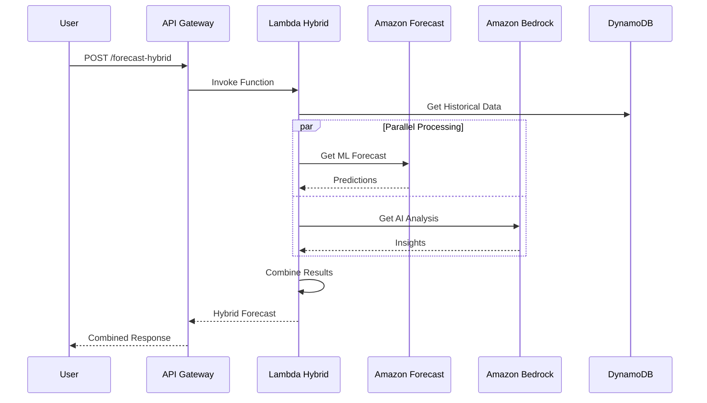
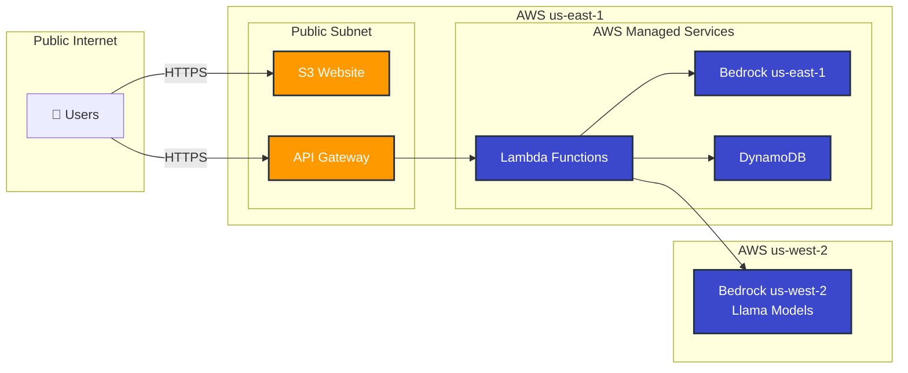
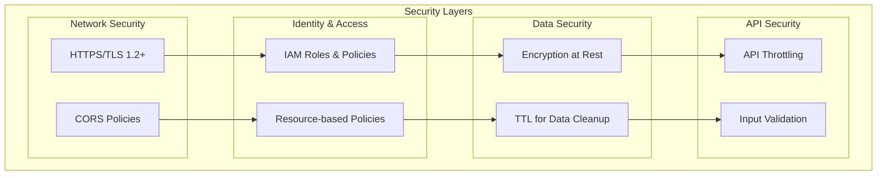
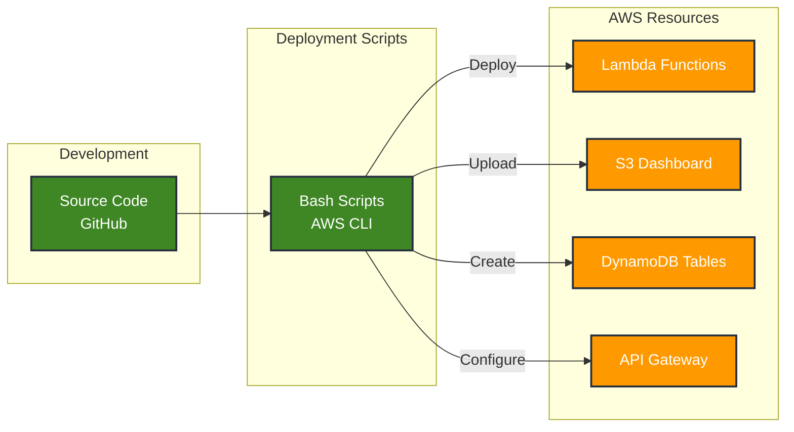
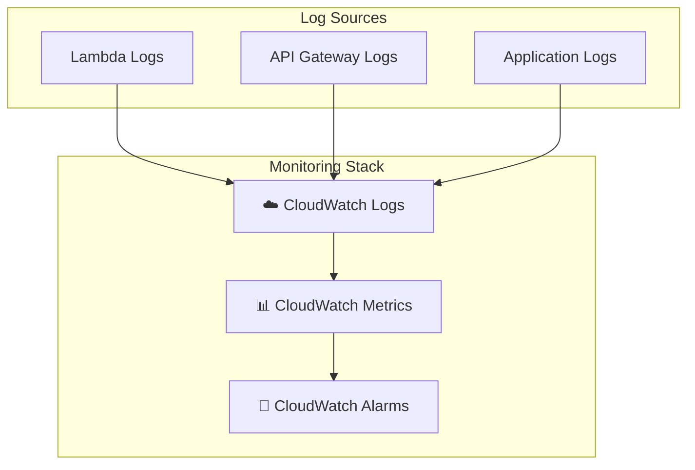

# AI Retail Intelligence - AWS Architecture Diagram

## Complete System Architecture

## Data Flow Diagrams

### 1. Price Forecasting Flow

### 2. Document Analysis with History Flow

### 3. Hybrid Forecasting Flow

## Component Details

### AWS Services Used

| Service | Purpose | Configuration |
|---------|---------|---------------|
| **Amazon S3** | Static website hosting for dashboard | Bucket: ai-retail-dashboard-439786465522 Public read access Website hosting enabled |
| **API Gateway** | REST API endpoints | API ID: foiwdbvnx6 Stage: prod CORS enabled |
| **AWS Lambda** | Serverless compute for business logic | 6 functions Python 3.11 256-512 MB memory |
| **Amazon Bedrock** | AI/ML inference | 9 models across 2 regions Nova (us-east-1) Llama (us-west-2) |
| **DynamoDB** | NoSQL database | 2 tables Pay-per-request billing TTL enabled |
| **IAM** | Security and permissions | Role: AIRetailIntelligenceLambdaRole Bedrock + DynamoDB access |
| **Amazon Forecast** | Time series forecasting (optional) | Not yet configured |

### Lambda Functions

| Function | Runtime | Memory | Timeout | Purpose |
|----------|---------|--------|---------|---------|
| ai-retail-forecast | Python 3.11 | 512 MB | 60s | Price forecasting with 6 AI models |
| ai-retail-current-prices | Python 3.11 | 256 MB | 30s | Current price data retrieval |
| ai-retail-market-copilot | Python 3.11 | 512 MB | 60s | AI Q&A assistant |
| ai-retail-document-analysis | Python 3.11 | 512 MB | 60s | Document analysis with 7 AI models |
| ai-retail-forecast-hybrid | Python 3.11 | 512 MB | 60s | Hybrid forecasting (Forecast + Bedrock) |
| ai-retail-document-history | Python 3.11 | 256 MB | 30s | History retrieval from DynamoDB |

### AI Models Available

#### Document Analysis (7 Models)
- **Amazon Nova**: Micro, Lite, Pro
- **Meta Llama**: 3.2 3B, 3.1 8B, 3.3 70B, 4 Scout 17B

#### Price Forecasting (6 Models)
- **Amazon Nova**: Lite, Pro
- **Meta Llama**: 3.3 70B, 4 Scout 17B
- **DeepSeek**: V3, R1

### DynamoDB Tables

#### CurrentPrices
- **Partition Key**: symbol (String)
- **Attributes**: price, change, change_percent, timestamp
- **Purpose**: Store current gold, silver, ETF prices

#### DocumentAnalysisHistory
- **Partition Key**: document_id (String)
- **TTL**: 90 days
- **Attributes**: timestamp, text, analysis results, metadata
- **Purpose**: Store document analysis history

## Network Architecture

## Cost Breakdown

### Monthly Cost Estimate (Moderate Usage)

| Service | Usage | Cost |
|---------|-------|------|
| **S3** | 1 GB storage + 10K requests | ~$0.50 |
| **API Gateway** | 100K requests | ~$0.35 |
| **Lambda** | 100K invocations, 512 MB | ~$2.00 |
| **Bedrock** | 1M tokens (mixed models) | ~$5.00 |
| **DynamoDB** | 1 GB storage, 100K requests | ~$1.50 |
| **Data Transfer** | 10 GB out | ~$0.90 |
| **Total** | | **~$10.25/month** |

## Security Architecture

### Security Features

- ✅ HTTPS/TLS encryption for all traffic
- ✅ IAM role-based access control
- ✅ DynamoDB encryption at rest
- ✅ CORS policies for API access
- ✅ Input validation in Lambda functions
- ✅ API Gateway throttling
- ✅ 90-day TTL for automatic data cleanup
- ✅ No hardcoded credentials

## Deployment Architecture

## High Availability & Scalability

- **S3**: 99.99% availability, automatic scaling
- **API Gateway**: Automatic scaling, regional deployment
- **Lambda**: Auto-scaling, concurrent execution limits
- **DynamoDB**: Auto-scaling, on-demand capacity
- **Bedrock**: Managed service, automatic scaling

## Monitoring & Logging

### Available Metrics

- Lambda invocations, duration, errors
- API Gateway requests, latency, 4xx/5xx errors
- DynamoDB read/write capacity, throttles
- Bedrock model invocations, token usage

## URLs & Endpoints

### Live URLs
- **Dashboard**: http://ai-retail-dashboard-439786465522.s3-website-us-east-1.amazonaws.com
- **API Base**: https://foiwdbvnx6.execute-api.us-east-1.amazonaws.com/prod

### API Endpoints
- `POST /forecast` - Price forecasting
- `GET /current-prices` - Current prices
- `POST /market-copilot` - AI Q&A
- `POST /analyze-document` - Document analysis
- `POST /forecast-hybrid` - Hybrid forecasting
- `GET /document-history` - History retrieval

---

**Last Updated**: March 7, 2026  
**AWS Account**: 439786465522  
**Primary Region**: us-east-1  
**Secondary Region**: us-west-2 (Bedrock Llama models)
